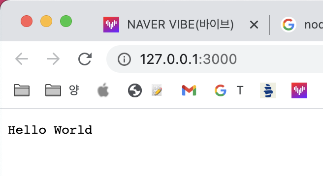

# JS0일차

## 웹서버란?😛

1. **웹 서버 : [웹 브라우저](https://ko.wikipedia.org/wiki/%EC%9B%B9_%EB%B8%8C%EB%9D%BC%EC%9A%B0%EC%A0%80)와 같은 클라이언트로부터 [HTTP](https://ko.wikipedia.org/wiki/HTTP) 요청을 받아들이고, [HTML](https://ko.wikipedia.org/wiki/HTML) 문서와 같은 웹 페이지를 반환하는 [컴퓨터 프로그램](https://ko.wikipedia.org/wiki/%EC%BB%B4%ED%93%A8%ED%84%B0_%ED%94%84%EB%A1%9C%EA%B7%B8%EB%9E%A8)**
2. 웹 서버 (하드웨어) : 위에 언급한 기능을 제공하는 컴퓨터 프로그램을 실행하는 [컴퓨터](https://ko.wikipedia.org/wiki/%EC%BB%B4%ED%93%A8%ED%84%B0)

**웹 서버(Web Server)는 HTTP를 통해 웹 브라우저에서 요청하는 HTML 문서나 오브젝트(이미지 파일 등)을 전송해주는 서비스 프로그램을 말한다.** 

웹 서버 소프트웨어를 구동하는 하드웨어도 웹 서버라고 해서 혼동하는 경우가 간혹 있다. 😢

> HTTP요청을 받아 웹 페이지(css,js를 포함한 HTML 문서)를 클라이언트로 전달하는 것.

---

# 런타임?

- 프로그램이 실행되고 있는 동안의 동작
- **프로그램이 실행되고 있는 때 존재하는 곳, 프로그래밍 언어가 구동되는 환경**
- 프로그램이 실행되는 동안의 시간

런타임 환경(Runtime Environment): 운영제체 위에서 또는 운영체제 자체에서 실행되며 위 계층이 사용하거나 필요한 서비스를 제공하는 환경 (ex. JRE (Java Runtime Environment))

런타임은 프로그램이 실행 되는 동안 실행 되는 소프트웨어 / 명령 , 특히 명시 적으로 작성하지 않았지만 코드를 올바르게 실행하는 데 필요한 명령을 설명합니다. 런타임은 코드가 실행되는 모든 라이브러리, 프레임 워크 또는 플랫폼을 나타내는 일반적인 용어입니다.

- 노드js는 무엇인가?

    확장성 있는 네트워크 애플리케이션 개발에 사용되는 소프느웨어 플랫폼으로 자바스크립트를 사용하며, 비동기 단일 스레드 이벤트 루프를 통해 높은 처리 성능을 가진다. (Non-blocking I/O 사용)

    내장 HTTP 서버 라이브러리를 포함하고 있어 웹 서버에서 아파치 등의 별도의 소프트웨어 없이 동작하는 것이 가능하며 이를 통해 웹 서버의 동작에 있어 더 많은 통제를 가능케 한다.

    파일이 얼마나 업로드되었는지 알기 위해서는 서버에 쿼리를 전송해야 한다는 점을 보고 조금 더 쉬운 방법을 찾다가 고안해 내었으며 2019년 4월, Node.js v12 부터 ECMA스크립트의 공식 모듈 시스템 사용을 실험적으로 지원하기 시작했다. (그 이전까지는 서드파티인 CommonJS 모듈만을 사용해오고 있었다.)

    V8 자바스크립트 엔진으로 빌드되었다.

    [파이썬](https://ko.wikipedia.org/wiki/%ED%8C%8C%EC%9D%B4%EC%8D%AC)으로 만든 [트위스티드](https://ko.wikipedia.org/wiki/%ED%8A%B8%EC%9C%84%EC%8A%A4%ED%8B%B0%EB%93%9C_(%EC%86%8C%ED%94%84%ED%8A%B8%EC%9B%A8%EC%96%B4)), [펄](https://ko.wikipedia.org/wiki/%ED%8E%84)로 만든 [펄 객체 환경](https://en.wikipedia.org/wiki/Perl_Object_Environment), [루비](https://ko.wikipedia.org/wiki/%EB%A3%A8%EB%B9%84_(%ED%94%84%EB%A1%9C%EA%B7%B8%EB%9E%98%EB%B0%8D_%EC%96%B8%EC%96%B4))로 만든 이벤트 머신과 그 용도가 비슷하다. **대부분의 [자바스크립트](https://ko.wikipedia.org/wiki/%EC%9E%90%EB%B0%94%EC%8A%A4%ED%81%AC%EB%A6%BD%ED%8A%B8)가 웹 브라우저에서 실행되는 것과는 달리,** 

    **서버 측에서 실행된다.** 일부 [CommonJS](https://ko.wikipedia.org/wiki/CommonJS) 명세[[3]](https://ko.wikipedia.org/wiki/Node.js#cite_note-3)를 구현하고 있으며, 쌍방향 테스트를 위해 [REPL](https://ko.wikipedia.org/wiki/REPL) 환경을 포함하고 있다.

- CommonJS?
- REPL?

# npm?

패키지 매니저인 npm은 2011년에 처음 소개되었다.

# js vs python

python은 범용 언어, js는 글자 효과 같은 거 주려고 만든 언어.

Node=v8+node 런타임라이브러리

크롬=v8+렌더링엔진+기타등등

- **hello.js 를 만들자!**

    node hello.js

    ```jsx
    const http = require('http');

    const hostname = '127.0.0.1';
    const port = 3000;

    const server = http.createServer((req, res) => {
        res.statusCode = 200;
        res.setHeader('Content-Type', 'text/plain');
        res.end('Hello World');
    });

    server.listen(port, hostname, () => {
        console.log(`Server running at http://${hostname}:${port}/`);
    });
    ```

    